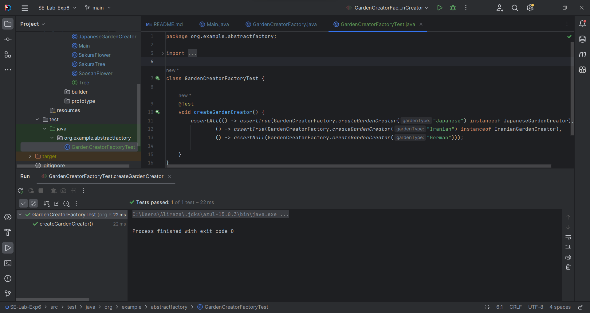
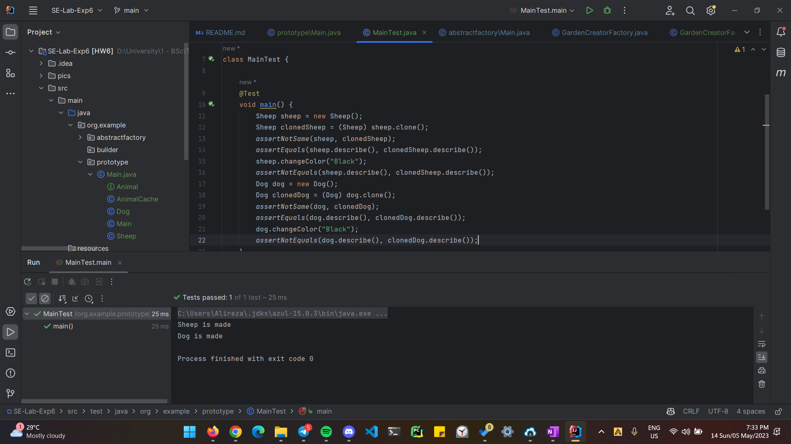
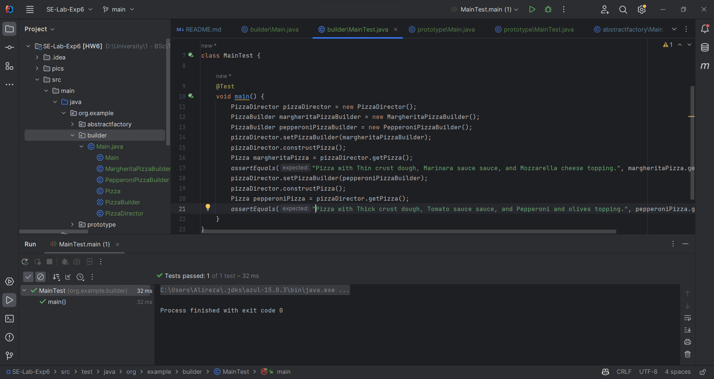

# SE-Lab-Exp6
### شماره دانشجویی
- Alireza Honarvar - 98102551
- Ali Najibi - 98106123

## موضوع
این پروژه درباره کاربرد عملی الگوهای طراحی شئ‌گرا با استفاده از روش TDD می‌باشد.

## گزارش
### 1.1. الگوی Abstract Factory
به فولدر abstractfactory مراجعه کنید.
در اینجا ۳ interface و ۷ کلاس نوشته شده و یک فایل Main داریم که نقطه شروع اجرا می‌باشد.

Tree interface:

این یک واسطه می‌باشد که در سطح انتزاعی بیان می‌کند درخت‌ها قابلیت رشد کردن دارند. حال هر نوع درخت باید این تابع را پیاده‌سازی کند.

Flower interface:

این یک واسطه می‌باشد که در سطح انتزاعی بیان می‌کند گل‌ها قابلیت شکوفا شدن دارند. حال هر نوع گل باید این تابع را پیاده‌سازی کند.

AbstractGardenCreator:

در این واسطه صرفا در سطح انتزاعی بیان می‌کنیم که هر GardenCreator  باید قابلیت ساخت درخت و گل نوع خاص خود را داشته باشد. حال پیاده‌سازی به توابع فرزند آن مربوط می‌شود.

[Japanese/Iranian]GardenCreator:

در این کلاس‌ها که AbstractGardenCreator را پیاده‌سازی می‌کنند، نوع درخت و گلی که باید ساخته شود مشخص شده است.

[Gaj/Sakura]Tree:

در هر یک از این کلاس‌ها که Tree را پیاده‌سازی می‌کنند، نوع رشد کردن آن مشخص شده است. توجه شود که ممکن است یک Tree هزاران method و property داشته باشد و تمامی آنها می‌توانند بسته به نوع متفاوت باشند که در کلاس درخت ایرانی و ژاپنی باید به‌نوبه بیان شود.

[Soosan/Sakura]Flower:

مطابق توضیح فوق، اما برای گل.

GardenCreatorFactory:
در اینجا کلاینت نوع محصول مورد نظر خود را انتخاب می‌کند، بر فرض ایرانی. و یک GardenCreator از نوع مد نظر برگردانده می‌شود. سپس کلاینت مطابق با انتظاراتش، درخت و گل می‌سازد و مشاهده می‌کند که ویژگی‌های نوع مد نظرش را دارد.

تست:

### 1.2. الگوی Prototype
به فولدر prototype مراجعه کنید.
برای پیاده‌سازی این الگوی طراحی، یک مثال در نظر گرفته شده است. سگ و گوسفند کلاس‌هایی از جنس حیوان هستند. یک سگ و گوسفند در AnimalCache نگه می‌داریم که از هرکدام ممکن است تعداد متفاوتی نیاز داشته باشیم و بخواهیم در هرکدام بصورت مستقل تغییراتی اعمال کنیم.
با استفاده از تابع getAnimal هر دفعه که حیوانی را صدا می‌زنیم، یک نمونه جدید از آن بوجود می‌آید و اگر فرضا property از آن  را تغییر دهیم، سایر نمونه‌های آن حیوان تغییری نخواهند کرد.
این کار به دلیل Cloneable بودن کلاس حیوان به سادگی امکان‌پذیر شده است. سگ و گوسفند واسطه حیوان را پیاده‌سازی کرده‌اند و تابع clone را برای خود تعریف کرده‌اند. توجه کنید که برای کلاس‌هایی که فیلدهای زیادی دارند، تمامی مراحل clone کردن در تابع clone نوشته می‌شود و این باعث می‌شود فرآیند clone کردن برای کاربر صرفا صدا زدن یک تابع شود.

تست:

### 1.3. الگوی Builder
به فولدر builder مراجعه کنید.
برای پیاده‌سازی این الگوی طراحی، یک مثال در نظر گرفته شده است. پیتزا می‌تواند اجزای مختلفی داشته باشد که بسته به نوع پیتزا، تعدادی یا تمامی این اجزا با هم متفاوت باشند. با توجه به Builder هر نوع پیتزا، آن نوع پیتزا را می‌سازیم. هر Builder نیز باید ویژگی‌های پایه ساختن پیتزا را داشته باشد که در کلاس PizzaBuilder آن‌ها را مطرح کرده‌ایم. کلاس PizzaDirector نیز مسئولیت مدیریت PizzaBuilder را برعهده می‌گیرد و تابع‌هایش را صدا می‌زند تا پیتزا در PizzaBuilder درست شود. و سپس می‌توانیم با getPizza آن را تحویل بگیریم.

تست:

### 1.4. پرسش‌ها
۱.

دسته‌ها بصورت زیر هستند:

۱. الگوهای ساختاری (Structural): این الگو‌ها برای توصیف چگونگی جمع‌آوری اشیاء در ساختارهای بزرگتر بوجود آمده‌اند و تمرکز روی انعطاف‌پذیری و کارآمدی ساختار بوجود آمده دارند.

۲. الگوهای ایجادکننده (Creational): این الگو‌ها برای آسودگی مکانیزم ساخت و ساز اشیاء بوجود آمده‌اند و تمرکز روی افزایش انعطاف‌پذیری و استفاده مجدد از کد دارند.

۳. الگوهای رفتاری (Behavioral): این الگوها مربوط به الگوریتم‌ها و تخصیص وظایف بین اشیاء می‌باشند.

۲.

این ۳ الگو همانطور که از مثال‌ها واضح است، مرتبط با نحوه ساخت اشیاء می‌باشد و در دسته Creational قرار می‌گیرند.

۳.

تفاوت اصلی SOLID و GoF در وسعت و کلیت راه‌حل‌های ارائه شده است. SOLID با تمرکز روی ماژولار بودن، قابلیت نگهداری و توسعه‌پذیری اصول high-level و کلی‌ای را بیان می‌کند. این اصول باید در تمامی سیستم و کامپوننت‌ها رعایت شود.

در حالی که GoF شامل ۲۳ الگوی مکرر در توسعه نرم‌افزار می‌باشد که هرکدام راه‌حل رفع یک مشکل خاص و دقیق می‌باشند. در نتیجه جزئی‌تر از SOLID هستند و تمرکز بیشتری روی صورت مسئله‌ی خاص خود دارند. 

۴.

بله. اصل Single Responsibility را نقض می‌کند، چرا که در این الگو، راه‌حل برای رفع دو مشکل همزمان آورده شده است و دو مسئولیت را داراست.
اولی اطمینان حاصل کردن از اینکه کلاس تنها یک نمونه دارد. دومی اینکه این شیء گلوبال را محافظت کند تا در کدهای دیگر overwrite نشود.